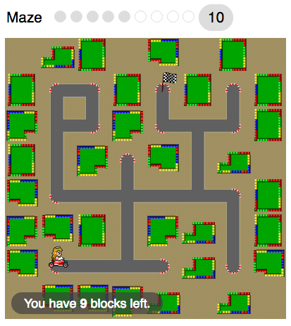

# Modifications in this fork:

- new Makefile rule `ubi-kids` which builds only the `Maze` game with English
  and French enabled.
- `Maze` skinned with Mario Kart theme:
  - Can choose between Mario and Peach
  - Maze is Mario Circuit tileset
  - Mario Kart sounds and custom finish animation.

----------------------------------------
*Original README.md*

Google's Blockly Games is a series of educational games that teach programming.
It is based on the [Blockly](https://developers.google.com/blockly/) library.
All code is free and open source.

**The games are at https://blockly-games.appspot.com/**

**The developer's site is at https://github.com/google/blockly-games/wiki**
